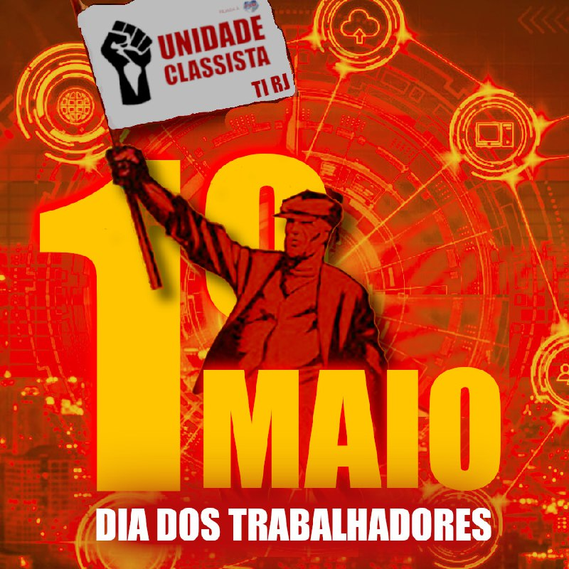

# 1º de maio e os profissionais de TI 
 

O Dia do Trabalhador serve para lembrarmos e comemorarmos as nossas lutas, vitórias e sacrifícios, para construirmos a nossa Consciência de Classe. 
 
Precisamos lembrar que nossas conquistas sempre vieram a partir da luta coletiva de trabalhadoras e trabalhadores, das mobilizações sindicais, das greves que paralisaram a produção e do enfrentamento direto contra as forças da classe dominante. 
 
Se hoje o comum é ter uma jornada de trabalho de 8 horas por dia, se nossas crianças não trabalham em áreas insalubres, se existe alguma preocupação com a saúde de trabalhadoras e trabalhadores, se existe uma aposentadoria para quando não formos mais capazes de produzir, entre tantos outros direitos que parecem a nós que sempre existiram, tudo foi conquistado e só se manterá com a nossa organização e luta popular. 
 
Para nós, profissionais de TI, pensar sobre essas conquistas e entender quando e como elas foram adquiridas é vital, para que possamos compreender a verdade e a nossa força. 
 
Nossa categoria foi bombardeada por mentiras liberais que fizeram muitos de nós não se perceber como trabalhadoras e trabalhadores, fizeram muitos acreditarem que, por receber um salário melhor que a maioria da população, ou ter MEI, ou ser PJ, ou até ter uma microempresa, não estão do mesmo lado que as pessoas exploradas. Uma mentira que chega em alguns dos nossos sindicatos e faz os mesmos negarem a sindicalização de trabalhadores e trabalhadoras na situação de MEI ou PJ. 
 
Profissionais de TI são trabalhadoras e trabalhadores, se vendermos nossa mão de obra para sobreviver, se precisamos trabalhar todos os dias para mantermos nosso padrão de vida, não importa se temos CLT ou CNPJ, se estamos no setor público ou privado, se ganhamos salário-mínimo ou valores muito maiores que a maioria da população, se recebemos a partir de um salário via CLT ou uma nota fiscal de serviços via CNPJ, não importa se gastamos tudo que recebemos ou se temos pequenos investimentos que acabariam em poucos meses se não nos mantivermos trabalhando. Em qualquer uma dessas situações somos trabalhadoras e trabalhadores! 
 
É preciso afirmar isso, é preciso ter orgulho disso! Quando o liberalismo disser que seremos o próximo Bill Gates ou Steve Jobs, herdeiros que aumentaram o capital de suas famílias explorando e assediando milhares de profissionais de TI, nós devemos entender que isso é uma mentira. O melhor não é ser um bilionário explorador de milhares de trabalhadores e trabalhadoras, precisamos afirmar que queremos um salário justo, digno, suficiente para viver bem e com conforto, que o melhor é uma sociedade que todos e todas possam ter esses mesmos direitos, uma sociedade onde o livre desenvolvimento de cada um é a condição para o livre desenvolvimento das pessoas e da sociedade. 
 
Junto a essas certezas, também é importante entender que a nossa categoria tem uma força que pode ser alcançada pela mobilização de toda a classe trabalhadora. Que empresa hoje consegue manter seu pleno funcionamento sem profissionais de TI? Que banco funcionaria com seus servidores desligados? Que grande nome do capital não tem um sistema de informação que controla o coração da sua exploração da produção de valor? 
 
A nossa mobilização como classe nos traz benefícios pessoais, benefícios para a nossa categoria, e mais, pode ser uma ferramenta importante para ajudar na construção de um mundo melhor, com menos exploração, menos desemprego, livre da fome e da violência. 
 
Nesse dia 1º de maio não esqueçamos do passado, ele nos ajuda a nos organizarmos, só assim, podemos construir um futuro melhor para todas as pessoas que amamos