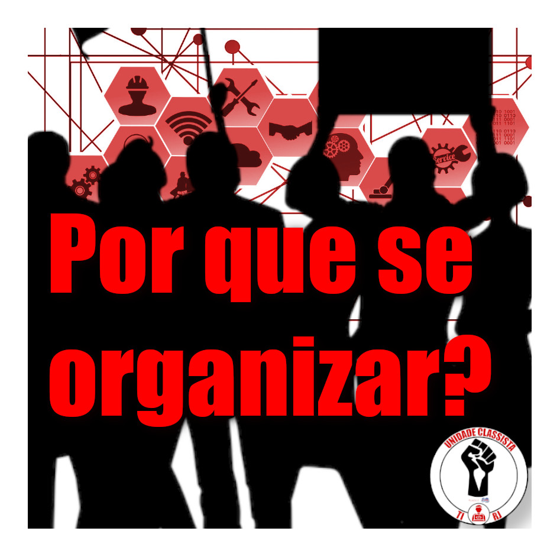

# Por que se organizar?
 

Nós trabalhadores de TI sofremos constantes ataques a nossos direitos e somos historicamente classificados como atividades-meio, temos como um exemplo
desses ataques o fato de ser prática comum a terceirização mesmo antes 
da nova legislação de 2017. A terceirização acarreta a categoria redução
salarial, instabilidade do vínculo empregatício, perda de benefícios básicos garantidos pela CLT e aumento da carga horária.

É interessante lembrarmos que essa terceirização que sofremos desde o início da história da nossa categoria nos empurra em direção a "pjotização" através da propaganda que faz muitos de nós acreditar que caso o empregador pague menos impostos esses valores seriam revertidos ao profissional, o que nunca ocorreu.

Existe ainda a mítica de que todos os profissionais de TI são bem remunerados, o que na prática não acontece. Somos em maioria trabalhadores com baixo salários e precarizados, como ocorre comumente com profissionais que atuam cuidando de redes e/ou formatando computadores e mesmos os trabalhadores que alcançam um salário justo para os padrões brasileiros, exceções entre a grande maioria, há superexploração da carga horária de trabalho entre outras precarizações. Somos também uma das categorias mais expostas a transtornos mentais e de comportamento relacionados ao trabalho, devido à pressão comum em nossos ambientes.

Além do que já foi citado, enquanto recebemos uma forte propaganda alimentando a ideia de que não devemos nos sindicalizar, temos a ampla organização dos patrões em seus sindicatos patronais como o TI Rio, chegando até mesmo a ter uma federação nacional chamada FENAINFO, ou seja, eles estão organizados enquanto nos empurram para uma desorganização. Essas organizações(TI Rio, FENAINFO e etc) são onde eles debatem e acordam pelas nossas costas todos os ataques já mencionados e muitos outros.

Esse cenário demonstra que precisamos fortalecer a organização dos trabalhadores de TI para termos condições de alcançar as nossas demandas e forças para lutar pelos nossos direitos. Para ajudar nesta organização existe a Unidade Classista, um coletivo com atuação sindical e de lutas pelo local de trabalho e o nosso comitê de base de TI da Unidade Classista do RJ, criado em 2020, apresenta-se como uma opção para a organização da nossa categoria, lutando pelas demandas específicas dos profissionais de TI e dos trabalhadores como um todo. 

Com isso convidamos você a participar e construir conosco este coletivo. junte-se a Unidade Classista, sindicalize-se e construa um futuro melhor para os trabalhadores!
